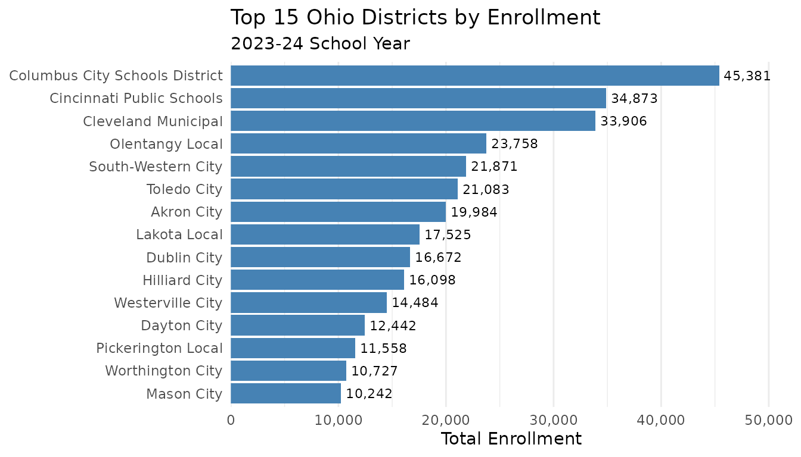
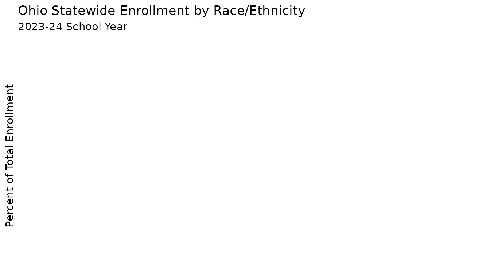
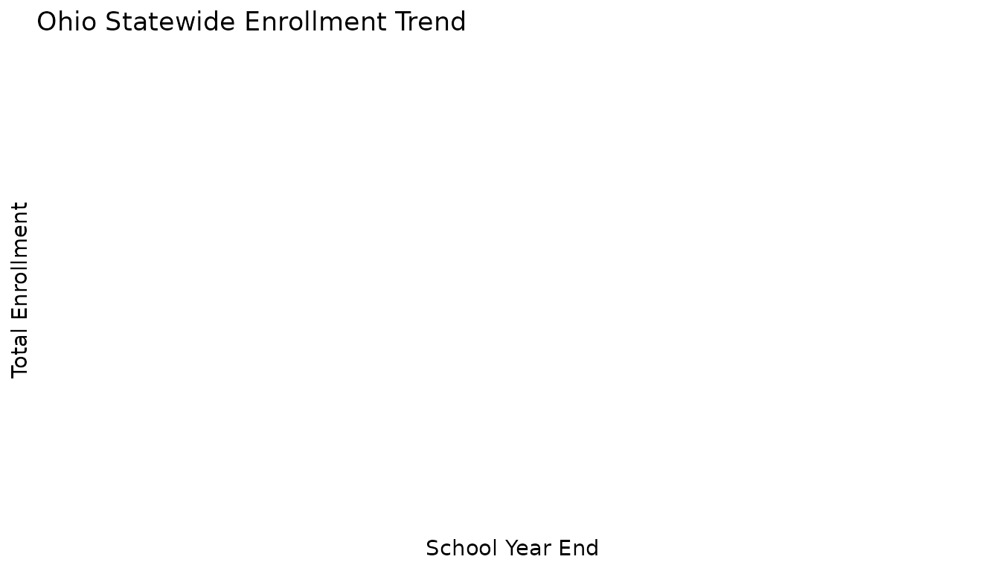
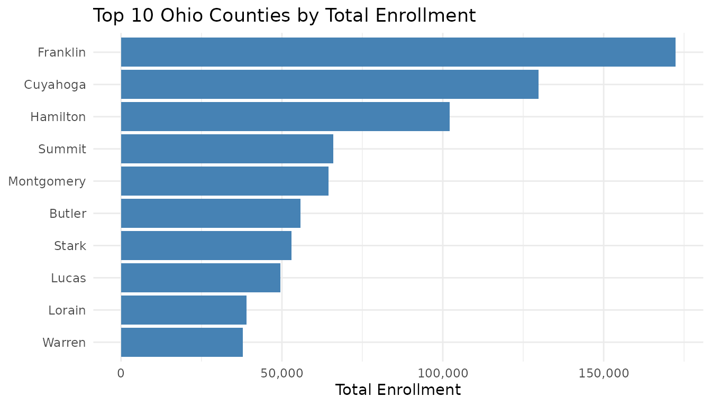

# Getting Started with ohschooldata

## Overview

The `ohschooldata` package provides tools for fetching and analyzing
Ohio school enrollment data from the Ohio Department of Education and
Workforce (ODEW). This vignette covers:

1.  Installation and setup
2.  Basic data fetching
3.  Understanding the data schema
4.  Working with IRN codes
5.  Filtering and analysis
6.  Visualization examples

## Installation

Install from GitHub:

``` r
# install.packages("remotes")
remotes::install_github("almartin82/ohschooldata")
```

Load the package along with helpful companions:

``` r
library(ohschooldata)
library(dplyr)
library(ggplot2)
```

## Data Access Note

**Important**: The Ohio Department of Education and Workforce Report
Card portal uses dynamic tokens for file access. If automated downloads
fail, you may need to: 1. Visit
<https://reportcard.education.ohio.gov/download> 2. Select year and
download Enrollment files manually 3. Use
[`import_local_enrollment()`](https://almartin82.github.io/ohschooldata/reference/import_local_enrollment.md)
to load the downloaded files

## Basic Data Fetching

### Fetch a Single Year

The main function is
[`fetch_enr()`](https://almartin82.github.io/ohschooldata/reference/fetch_enr.md),
which downloads and processes enrollment data:

``` r
# Fetch 2024 enrollment data (2023-24 school year)
enr <- fetch_enr(2024, use_cache = TRUE)

# View the first few rows
head(enr)
```

    ##   end_year district_irn building_irn       district_name building_name
    ## 1     2024       000442           NA    Manchester Local          <NA>
    ## 2     2024       043489           NA          Akron City          <NA>
    ## 3     2024       043497           NA       Alliance City          <NA>
    ## 4     2024       043505           NA        Ashland City          <NA>
    ## 5     2024       043513           NA Ashtabula Area City          <NA>
    ## 6     2024       043521           NA         Athens City          <NA>
    ##   entity_type    county district_type grade_level         subgroup n_students
    ## 1    District     Adams      District       TOTAL total_enrollment        689
    ## 2    District    Summit      District       TOTAL total_enrollment      19984
    ## 3    District     Stark      District       TOTAL total_enrollment       2933
    ## 4    District   Ashland      District       TOTAL total_enrollment       3042
    ## 5    District Ashtabula      District       TOTAL total_enrollment       2879
    ## 6    District    Athens      District       TOTAL total_enrollment       2288
    ##   pct aggregation_flag is_state is_district is_building is_community_school
    ## 1   1           campus    FALSE        TRUE       FALSE               FALSE
    ## 2   1           campus    FALSE        TRUE       FALSE               FALSE
    ## 3   1           campus    FALSE        TRUE       FALSE               FALSE
    ## 4   1           campus    FALSE        TRUE       FALSE               FALSE
    ## 5   1           campus    FALSE        TRUE       FALSE               FALSE
    ## 6   1           campus    FALSE        TRUE       FALSE               FALSE
    ##   is_jvsd is_stem is_traditional
    ## 1   FALSE   FALSE           TRUE
    ## 2   FALSE   FALSE           TRUE
    ## 3   FALSE   FALSE           TRUE
    ## 4   FALSE   FALSE           TRUE
    ## 5   FALSE   FALSE           TRUE
    ## 6   FALSE   FALSE           TRUE

### Understanding the Year Parameter

The `end_year` parameter represents the end of the academic year:

- `2024` = 2023-24 school year
- `2023` = 2022-23 school year
- etc.

### Check Available Years

``` r
# See which years are available
list_enr_years()
```

    ##  [1] 2007 2008 2009 2010 2011 2012 2013 2014 2015 2016 2017 2018 2019 2020 2021
    ## [16] 2022 2023 2024 2025

Data is generally available from 2015 onwards.

## Understanding the Data Schema

### Tidy Format (Default)

By default,
[`fetch_enr()`](https://almartin82.github.io/ohschooldata/reference/fetch_enr.md)
returns data in **tidy (long) format**. Each row represents a single
observation for one entity, grade level, and subgroup combination.

``` r
# Key columns in tidy format
enr %>%
  select(end_year, district_irn, building_irn, district_name,
         entity_type, grade_level, subgroup, n_students, pct) %>%
  head(10)
```

    ##    end_year district_irn building_irn       district_name entity_type
    ## 1      2024       000442           NA    Manchester Local    District
    ## 2      2024       043489           NA          Akron City    District
    ## 3      2024       043497           NA       Alliance City    District
    ## 4      2024       043505           NA        Ashland City    District
    ## 5      2024       043513           NA Ashtabula Area City    District
    ## 6      2024       043521           NA         Athens City    District
    ## 7      2024       043539           NA      Barberton City    District
    ## 8      2024       043547           NA    Bay Village City    District
    ## 9      2024       043554           NA      Beachwood City    District
    ## 10     2024       043562           NA        Bedford City    District
    ##    grade_level         subgroup n_students pct
    ## 1        TOTAL total_enrollment        689   1
    ## 2        TOTAL total_enrollment      19984   1
    ## 3        TOTAL total_enrollment       2933   1
    ## 4        TOTAL total_enrollment       3042   1
    ## 5        TOTAL total_enrollment       2879   1
    ## 6        TOTAL total_enrollment       2288   1
    ## 7        TOTAL total_enrollment       3634   1
    ## 8        TOTAL total_enrollment       2365   1
    ## 9        TOTAL total_enrollment       1556   1
    ## 10       TOTAL total_enrollment       2853   1

| Column          | Description                                  |
|-----------------|----------------------------------------------|
| `end_year`      | School year end (e.g., 2024 for 2023-24)     |
| `district_irn`  | 6-digit district IRN                         |
| `building_irn`  | 6-digit building IRN (NA for district-level) |
| `district_name` | Name of the district                         |
| `building_name` | Name of the building (NA for district-level) |
| `entity_type`   | “State”, “District”, or “Building”           |
| `county`        | Ohio county name                             |
| `grade_level`   | Grade level (“TOTAL”, “PK”, “K”, “01”-“12”)  |
| `subgroup`      | Demographic or population subgroup           |
| `n_students`    | Student count                                |
| `pct`           | Percentage of total enrollment               |

### Subgroups

The `subgroup` column identifies demographic categories:

- `total_enrollment`: Total student count
- **Race/Ethnicity**: `white`, `black`, `hispanic`, `asian`,
  `native_american`, `pacific_islander`, `multiracial`
- **Special Populations**: `economically_disadvantaged`, `disability`,
  `english_learner`, `gifted`, `migrant`, `homeless`

``` r
# See all subgroups
enr %>%
  distinct(subgroup) %>%
  pull(subgroup)
```

    ##  [1] "total_enrollment"           "white"                     
    ##  [3] "black"                      "hispanic"                  
    ##  [5] "asian"                      "native_american"           
    ##  [7] "pacific_islander"           "multiracial"               
    ##  [9] "economically_disadvantaged" "disability"                
    ## [11] "english_learner"

### Wide Format

If you prefer one column per demographic (wide format):

``` r
# Fetch in wide format
enr_wide <- fetch_enr(2024, tidy = FALSE, use_cache = TRUE)

# View demographic columns
enr_wide %>%
  filter(entity_type == "State") %>%
  select(end_year, enrollment_total, white, black, hispanic, asian,
         economically_disadvantaged)
```

    ## [1] end_year                   enrollment_total          
    ## [3] white                      black                     
    ## [5] hispanic                   asian                     
    ## [7] economically_disadvantaged
    ## <0 rows> (or 0-length row.names)

You can also convert between formats:

``` r
# Convert wide to tidy
enr_tidy <- tidy_enr(enr_wide)
```

## Understanding IRN Codes

Ohio uses **IRN (Information Retrieval Number)** as the unique
identifier for all educational entities.

### What is an IRN?

- IRNs are **6-digit codes** (with leading zeros if necessary)
- Every district has a unique district IRN
- Every building (school) has a unique building IRN
- Examples:
  - Columbus City Schools: `043752`
  - Cleveland Metropolitan: `043786`
  - Cincinnati City: `043802`

### Working with IRNs

``` r
# Validate an IRN
is_valid_irn("043752")  # TRUE
```

    ## [1] TRUE

``` r
is_valid_irn("12345")   # FALSE (only 5 digits)
```

    ## [1] FALSE

``` r
# Format a numeric IRN with leading zeros
format_irn(43752)       # "043752"
```

    ## [1] "043752"

``` r
format_irn("43752")     # "043752"
```

    ## [1] "043752"

### Finding District IRNs

``` r
# Search for a district by name
enr %>%
  filter(is_district, subgroup == "total_enrollment", grade_level == "TOTAL") %>%
  filter(grepl("Columbus", district_name, ignore.case = TRUE)) %>%
  select(district_irn, district_name, county, n_students)
```

    ##   district_irn                  district_name   county n_students
    ## 1       043802 Columbus City Schools District Franklin      45381
    ## 2       049312           Columbus Grove Local   Putnam        726

## Filtering Data

### Aggregation Level Flags

The data includes boolean flags to identify aggregation levels:

``` r
# State totals
state <- enr %>% filter(is_state)

# All districts (excluding state totals)
districts <- enr %>% filter(is_district)

# All buildings (individual schools)
buildings <- enr %>% filter(is_building)
```

### Ohio School Type Flags

Ohio has several distinct school types:

``` r
# Traditional public districts
traditional <- enr %>% filter(is_traditional, is_district)

# Community schools (Ohio's term for charter schools)
community <- enr %>% filter(is_community_school, is_district)

# Joint Vocational School Districts (JVSDs) - Career-technical centers
jvsd <- enr %>% filter(is_jvsd, is_district)

# STEM schools
stem <- enr %>% filter(is_stem, is_district)
```

### Filter by District

Use
[`filter_district()`](https://almartin82.github.io/ohschooldata/reference/filter_district.md)
to get all data for a specific district:

``` r
# Get Columbus City Schools (district + all buildings)
columbus <- enr %>% filter_district("043752")

# Get district-level only (no buildings)
columbus_district <- enr %>% filter_district("043752", include_buildings = FALSE)
```

### Filter by County

Use
[`filter_county()`](https://almartin82.github.io/ohschooldata/reference/filter_county.md)
to get all entities in a county:

``` r
# Get all Franklin County districts and schools
franklin <- enr %>% filter_county("Franklin")

# Count districts by county
enr %>%
  filter(is_district, subgroup == "total_enrollment", grade_level == "TOTAL") %>%
  count(county, sort = TRUE) %>%
  head(10)
```

    ##        county  n
    ## 1    Cuyahoga 31
    ## 2    Hamilton 22
    ## 3    Trumbull 20
    ## 4       Stark 17
    ## 5      Summit 17
    ## 6    Franklin 16
    ## 7  Montgomery 16
    ## 8      Lorain 14
    ## 9    Mahoning 14
    ## 10 Columbiana 11

## Multi-Year Analysis

### Fetch Multiple Years

``` r
# Fetch a range of years
enr_history <- fetch_enr_range(2020, 2024, use_cache = TRUE)

# Or use purrr for more control
library(purrr)
enr_multi <- map_df(2020:2024, ~fetch_enr(.x, use_cache = TRUE))
```

### Statewide Trends

``` r
# Get statewide summary for multiple years
state_trend <- get_state_enrollment(2020:2024)

state_trend
```

    ##   end_year n_districts total_enrollment
    ## 1     2020         609          1571880
    ## 2     2021         608          1515306
    ## 3     2022         607          1525865
    ## 4     2023         608          1520728
    ## 5     2024         607          1507996

## Grade Level Analysis

### Individual Grades

``` r
# Enrollment by grade for state totals
enr %>%
  filter(is_state, subgroup == "total_enrollment", grade_level != "TOTAL") %>%
  select(grade_level, n_students) %>%
  arrange(grade_level)
```

    ## [1] grade_level n_students 
    ## <0 rows> (or 0-length row.names)

### Grade Aggregates

Create common grade-level groupings (K-8, 9-12, K-12):

``` r
# Create grade aggregates
grade_aggs <- enr_grade_aggs(enr)

# View K-8 vs High School for state
grade_aggs %>%
  filter(is_state) %>%
  select(grade_level, n_students)
```

    ## # A tibble: 0 × 2
    ## # ℹ 2 variables: grade_level <chr>, n_students <dbl>

## Visualization Examples

### Top Districts by Enrollment

``` r
# Top 15 districts by enrollment
top_districts <- enr %>%
  filter(is_district, subgroup == "total_enrollment", grade_level == "TOTAL") %>%
  arrange(desc(n_students)) %>%
  head(15)

ggplot(top_districts, aes(x = reorder(district_name, n_students), y = n_students)) +
  geom_col(fill = "steelblue") +
  geom_text(aes(label = scales::comma(n_students)), hjust = -0.1, size = 3) +
  coord_flip() +
  scale_y_continuous(labels = scales::comma, expand = expansion(mult = c(0, 0.15))) +
  labs(
    title = "Top 15 Ohio Districts by Enrollment",
    subtitle = "2023-24 School Year",
    x = NULL,
    y = "Total Enrollment"
  ) +
  theme_minimal() +
  theme(panel.grid.major.y = element_blank())
```



### Demographic Composition

``` r
# Statewide demographic breakdown
state_demos <- enr %>%
  filter(is_state, grade_level == "TOTAL",
         subgroup %in% c("white", "black", "hispanic", "asian", "multiracial")) %>%
  select(subgroup, n_students, pct) %>%
  mutate(subgroup = stringr::str_to_title(subgroup))

ggplot(state_demos, aes(x = reorder(subgroup, -n_students), y = pct)) +
  geom_col(fill = "steelblue") +
  geom_text(aes(label = scales::percent(pct, accuracy = 0.1)), vjust = -0.5, size = 3) +
  scale_y_continuous(labels = scales::percent, expand = expansion(mult = c(0, 0.1))) +
  labs(
    title = "Ohio Statewide Enrollment by Race/Ethnicity",
    subtitle = "2023-24 School Year",
    x = NULL,
    y = "Percent of Total Enrollment"
  ) +
  theme_minimal()
```



### Enrollment Trend Over Time

``` r
# Fetch multiple years for trend analysis
enr_trend <- fetch_enr_range(2018, 2024, use_cache = TRUE)

# State enrollment trend
state_trend <- enr_trend %>%
  filter(is_state, subgroup == "total_enrollment", grade_level == "TOTAL") %>%
  select(end_year, n_students)

ggplot(state_trend, aes(x = end_year, y = n_students)) +
  geom_line(color = "steelblue", size = 1) +
  geom_point(color = "steelblue", size = 3) +
  geom_text(aes(label = scales::comma(n_students)), vjust = -1, size = 3) +
  scale_y_continuous(labels = scales::comma, limits = c(1500000, NA)) +
  scale_x_continuous(breaks = 2018:2024) +
  labs(
    title = "Ohio Statewide Enrollment Trend",
    x = "School Year End",
    y = "Total Enrollment"
  ) +
  theme_minimal()
```



### County Comparison

``` r
# Top 10 counties by total enrollment
county_enr <- enr %>%
  filter(is_district, subgroup == "total_enrollment", grade_level == "TOTAL") %>%
  group_by(county) %>%
  summarize(total_enrollment = sum(n_students, na.rm = TRUE), .groups = "drop") %>%
  arrange(desc(total_enrollment)) %>%
  head(10)

ggplot(county_enr, aes(x = reorder(county, total_enrollment), y = total_enrollment)) +
  geom_col(fill = "steelblue") +
  coord_flip() +
  scale_y_continuous(labels = scales::comma) +
  labs(
    title = "Top 10 Ohio Counties by Total Enrollment",
    x = NULL,
    y = "Total Enrollment"
  ) +
  theme_minimal()
```



## Cache Management

Downloaded data is cached locally to speed up repeated requests:

``` r
# View cached files
cache_status()
```

    ##    year type size_mb age_days
    ## 1  2013 tidy    0.11        0
    ## 2  2015 tidy    0.13        0
    ## 3  2016 tidy    0.13        0
    ## 4  2017 tidy    0.70        0
    ## 5  2018 tidy    0.70        0
    ## 6  2019 tidy    1.41        0
    ## 7  2020 tidy    1.41        0
    ## 8  2021 tidy    1.40        0
    ## 9  2022 tidy    1.43        0
    ## 10 2023 tidy    1.42        0
    ## 11 2024 tidy    1.42        0
    ## 12 2024 wide    0.18        0
    ## 13 2025 tidy    1.41        0

``` r
# Clear cache for a specific year
clear_enr_cache(2024)

# Clear all cached data
clear_enr_cache()

# Force fresh download (bypasses cache)
enr_fresh <- fetch_enr(2024, use_cache = FALSE)
```

## Importing Local Files

If automated downloads fail, download files manually and import them:

``` r
# After downloading from reportcard.education.ohio.gov/download:
enr_local <- import_local_enrollment(
  district_file = "~/Downloads/23-24_ENROLLMENT_DISTRICT.xlsx",
  building_file = "~/Downloads/23-24_ENROLLMENT_BUILDING.xlsx",
  end_year = 2024
)

# Process the raw data
enr_processed <- process_enr(enr_local, 2024)
enr_tidy <- tidy_enr(enr_processed)
```

## Next Steps

- Explore the [function
  reference](https://almartin82.github.io/ohschooldata/reference/index.md)
  for detailed documentation
- See the [Data Quality QA
  vignette](https://almartin82.github.io/ohschooldata/articles/data-quality-qa.md)
  for data validation
- Check
  [`?fetch_enr`](https://almartin82.github.io/ohschooldata/reference/fetch_enr.md)
  for parameter details
- Use
  [`?filter_district`](https://almartin82.github.io/ohschooldata/reference/filter_district.md)
  and
  [`?filter_county`](https://almartin82.github.io/ohschooldata/reference/filter_county.md)
  for filtering helpers

## Session Info

``` r
sessionInfo()
```

    ## R version 4.5.2 (2025-10-31)
    ## Platform: x86_64-pc-linux-gnu
    ## Running under: Ubuntu 24.04.3 LTS
    ## 
    ## Matrix products: default
    ## BLAS:   /usr/lib/x86_64-linux-gnu/openblas-pthread/libblas.so.3 
    ## LAPACK: /usr/lib/x86_64-linux-gnu/openblas-pthread/libopenblasp-r0.3.26.so;  LAPACK version 3.12.0
    ## 
    ## locale:
    ##  [1] LC_CTYPE=C.UTF-8       LC_NUMERIC=C           LC_TIME=C.UTF-8       
    ##  [4] LC_COLLATE=C.UTF-8     LC_MONETARY=C.UTF-8    LC_MESSAGES=C.UTF-8   
    ##  [7] LC_PAPER=C.UTF-8       LC_NAME=C              LC_ADDRESS=C          
    ## [10] LC_TELEPHONE=C         LC_MEASUREMENT=C.UTF-8 LC_IDENTIFICATION=C   
    ## 
    ## time zone: UTC
    ## tzcode source: system (glibc)
    ## 
    ## attached base packages:
    ## [1] stats     graphics  grDevices utils     datasets  methods   base     
    ## 
    ## other attached packages:
    ## [1] purrr_1.2.1        ggplot2_4.0.1      dplyr_1.1.4        ohschooldata_0.1.0
    ## 
    ## loaded via a namespace (and not attached):
    ##  [1] gtable_0.3.6       jsonlite_2.0.0     compiler_4.5.2     tidyselect_1.2.1  
    ##  [5] stringr_1.6.0      jquerylib_0.1.4    systemfonts_1.3.1  scales_1.4.0      
    ##  [9] textshaping_1.0.4  readxl_1.4.5       yaml_2.3.12        fastmap_1.2.0     
    ## [13] R6_2.6.1           labeling_0.4.3     generics_0.1.4     curl_7.0.0        
    ## [17] knitr_1.51         tibble_3.3.1       desc_1.4.3         bslib_0.9.0       
    ## [21] pillar_1.11.1      RColorBrewer_1.1-3 rlang_1.1.7        stringi_1.8.7     
    ## [25] cachem_1.1.0       xfun_0.56          fs_1.6.6           sass_0.4.10       
    ## [29] S7_0.2.1           cli_3.6.5          pkgdown_2.2.0      withr_3.0.2       
    ## [33] magrittr_2.0.4     digest_0.6.39      grid_4.5.2         rappdirs_0.3.4    
    ## [37] lifecycle_1.0.5    vctrs_0.7.1        evaluate_1.0.5     glue_1.8.0        
    ## [41] cellranger_1.1.0   farver_2.1.2       codetools_0.2-20   ragg_1.5.0        
    ## [45] httr_1.4.7         rmarkdown_2.30     tools_4.5.2        pkgconfig_2.0.3   
    ## [49] htmltools_0.5.9
